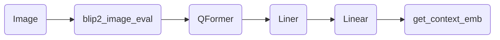

#### QFormer作用？


#### 结构图


#### prompt
```text
Give the following image: ImageContent</Img>. "
"You will be able to see the image once I provide it to you. Please answer my questions.
```
融合方法：
先将图像转为向量。将prompt除Image部分其他部分依次转为向量。
再将两者mix，得到最终向量。

```python
def get_context_emb(self, prompt, img_list):
    device = img_list[0].device
    prompt_segs = prompt.split("<ImageHere>")
    assert (
        len(prompt_segs) == len(img_list) + 1
    ), "Unmatched numbers of image placeholders and images."

    seg_tokens = [
        self.llama_tokenizer(seg, return_tensors="pt", add_special_tokens=i == 0)
        .to(device)
        .input_ids  # only add bos to the first seg
        for i, seg in enumerate(prompt_segs)
    ]

    seg_embs = [self.embed_tokens(seg_t) for seg_t in seg_tokens]

    mixed_embs = [emb for pair in zip(seg_embs[:-1], img_list) for emb in pair] + [
        seg_embs[-1]
    ]
    mixed_embs = torch.cat(mixed_embs, dim=1)
    return mixed_embs
```